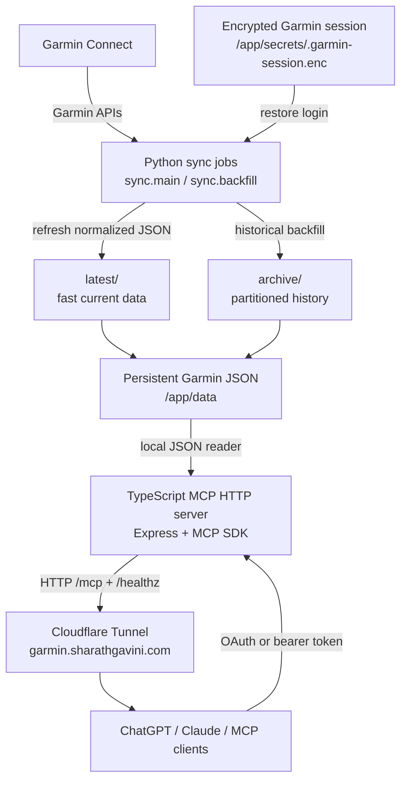
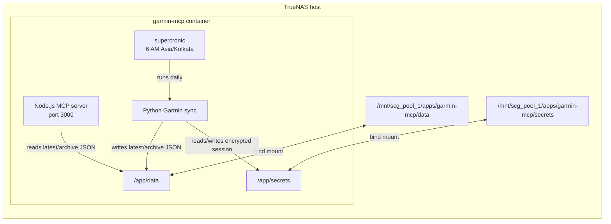
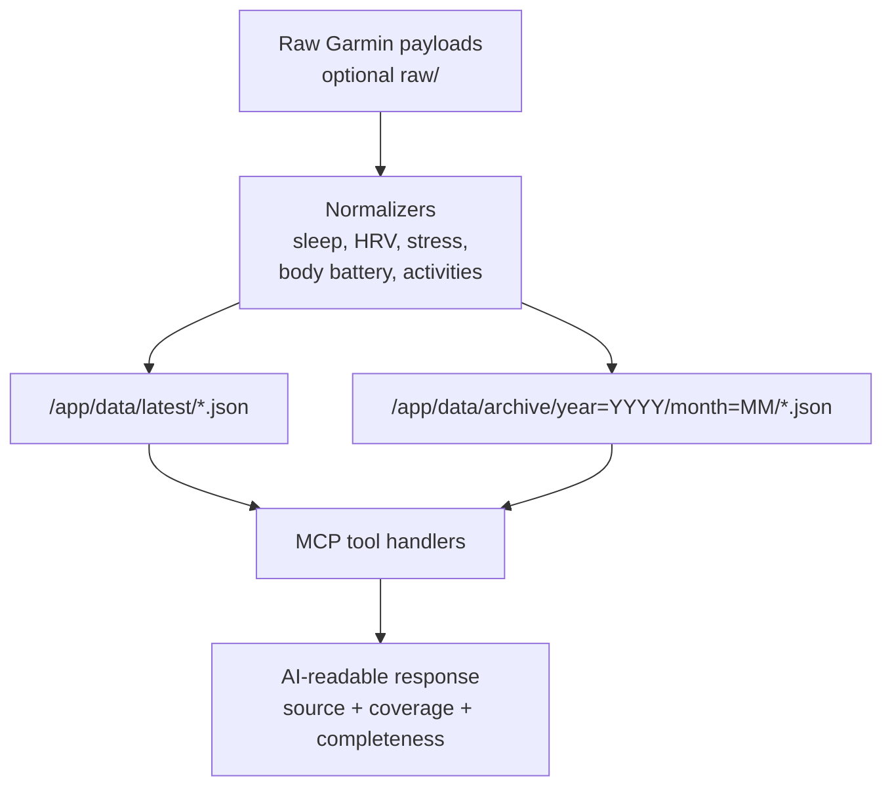
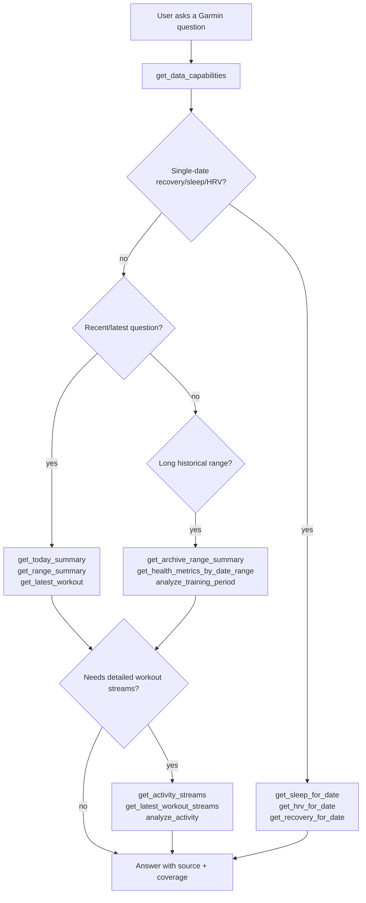
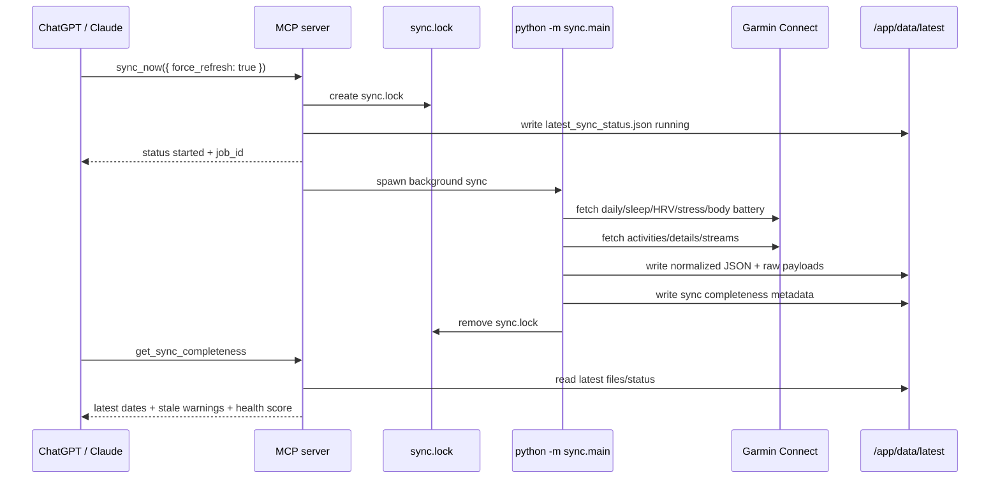
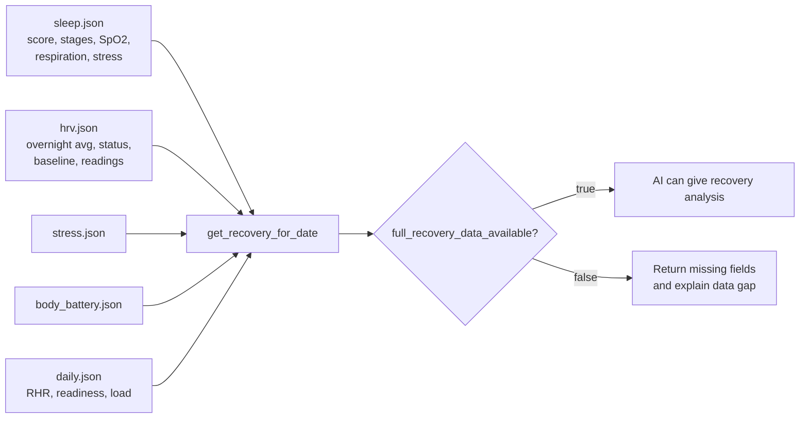
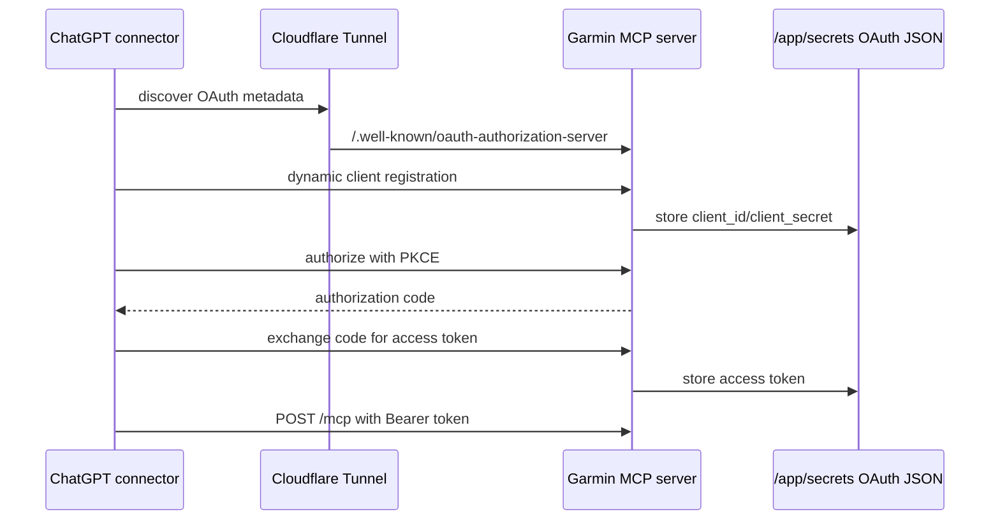

# Architecture

Garmin MCP is split into a sync plane and a serving plane.

## System Diagram



This is the main self-hosted shape. Garmin data is fetched by Python, stored as JSON on the TrueNAS bind mount, and served by the TypeScript MCP server through your Cloudflare Tunnel.

## Container View



The container has both runtimes because the server and sync jobs are intentionally separate processes:

- Node.js serves MCP requests.
- Python talks to Garmin Connect.
- `supercronic` runs daily sync inside the same container.
- TrueNAS bind mounts preserve data and secrets across rebuilds.

## Data Flow



The important design rule is that MCP does not call Garmin for ordinary reads. It reads prepared JSON. This keeps ChatGPT/Claude fast, predictable, and independent of Garmin API latency.

## Tool Selection Flow



Agents should start with `get_data_capabilities` for broad questions. They should use `source`, `sources_used`, `coverage`, `defaults_applied`, and stream completeness fields instead of guessing what data exists.

## `sync_now` Flow



`sync_now` does not block until Garmin finishes. It starts the job, then clients poll `get_sync_status` or `get_sync_completeness`.

## Recovery Readiness Flow



This is the reliability contract for recovery. If `full_recovery_data_available` is `true`, Garmin MCP has enough recovery data for that date. If it is `false`, the response includes a `missing` list such as `sleep_score` or `overnight_hrv`.

## OAuth / Remote Client Flow



OAuth here protects your private MCP server. It is not Garmin OAuth. Garmin authentication is handled separately by the encrypted Garmin session used by Python sync.

## Legacy Text Overview

```text
Garmin Connect
  |
  | encrypted session restore or login
  v
Python sync jobs
  |
  | write normalized JSON, raw payloads, streams, manifests, status
  v
Persistent data directory
  |
  +-- latest/
  |     +-- daily.json
  |     +-- activities.json
  |     +-- activity_details/
  |     +-- activity_streams/
  |     +-- raw/
  |
  +-- archive/
        +-- daily/year=YYYY/month=MM/daily.json
        +-- activities/year=YYYY/month=MM/activities.json
        +-- activity_details/
        +-- activity_streams/
        +-- raw/
  |
  v
TypeScript MCP HTTP server
  |
  +-- bearer auth
  +-- OAuth for remote MCP clients
  +-- /healthz
  +-- /mcp tools
  |
  v
ChatGPT / Claude / MCP clients
```

## Sync Plane

The sync plane lives in `sync/`.

Responsibilities:

- Restore encrypted Garmin session.
- Log in only when needed.
- Fetch daily health metrics.
- Fetch activities, activity details, and activity streams.
- Preserve raw Garmin payloads for future reprocessing.
- Normalize data into MCP-friendly JSON.
- Write status, checkpoint, and manifest files.
- Upload to GCS when Cloud Run mode is used.

Primary commands:

```bash
python -m sync.main --days 30 --output /app/data/latest
python -m sync.backfill --start-date 2025-10-01 --end-date 2026-06-14 --output /app/data/archive
```

## Serving Plane

The serving plane lives in `server/`.

Responsibilities:

- Serve MCP over HTTP at `/mcp`.
- Protect MCP with bearer token or OAuth access token.
- Serve health at `/healthz`.
- Read local JSON or GCS JSON.
- Expose latest, archive, stream, analysis, OAuth, and sync tools.
- Never handle Garmin passwords inside MCP tool calls.

## Storage Layout

Latest data is optimized for fast current-state questions:

```text
/app/data/latest/
  manifest.json
  latest_sync_status.json
  daily.json
  sleep.json
  hrv.json
  stress.json
  body_battery.json
  activities.json
  activity_details/{activity_id}.json
  activity_streams/{activity_id}.json
  raw/
```

Archive data is optimized for explicit date-range questions:

```text
/app/data/archive/
  manifest.json
  backfill_checkpoint.json
  daily/year=YYYY/month=MM/daily.json
  sleep/year=YYYY/month=MM/sleep.json
  hrv/year=YYYY/month=MM/hrv.json
  stress/year=YYYY/month=MM/stress.json
  body_battery/year=YYYY/month=MM/body_battery.json
  activities/year=YYYY/month=MM/activities.json
  activity_details/{activity_id}.json
  activity_streams/{activity_id}.json
  raw/
```

## Request Flow

Latest/recent tool:

```text
MCP client -> /mcp -> tool handler -> latest JSON reader -> response
```

Archive range tool:

```text
MCP client -> /mcp -> archive tool -> month partition reader -> coverage + rows -> response
```

Sync now:

```text
MCP client -> sync_now -> sync.lock -> background python sync -> latest_sync_status.json
```

## Authentication

The server accepts:

- `Authorization: Bearer $MCP_BEARER_TOKEN`
- OAuth access tokens issued by the built-in single-user OAuth flow

No unauthenticated sync endpoint exists.

## Deployment Modes

- Local sample-data development
- TrueNAS self-hosted Docker container
- Cloud Run plus GCS
- GitHub Actions scheduled sync
