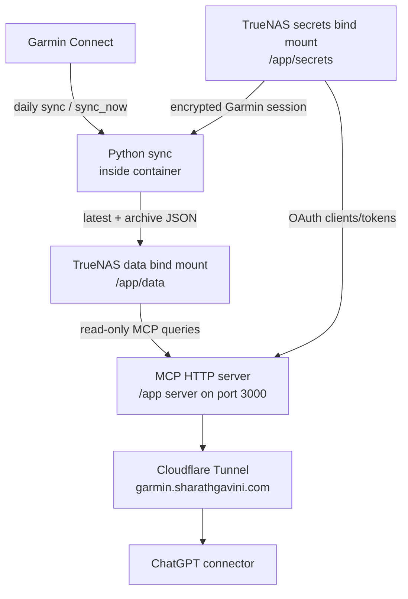

# End-to-End Guide

This guide explains the whole Garmin MCP system from empty TrueNAS folders to ChatGPT asking questions about your Garmin data.

## What You Are Building



There are two separate authentication systems:

- Garmin authentication: Python sync logs into Garmin Connect and stores an encrypted Garmin session in `/app/secrets/.garmin-session.enc`.
- MCP authentication: ChatGPT/Claude authenticate to your private MCP server with either OAuth tokens or `MCP_BEARER_TOKEN`.

The MCP server does not use your Garmin password during normal tool calls. It reads prepared JSON from `/app/data/latest` and `/app/data/archive`.

## 1. TrueNAS Host Directories

Create persistent directories:

```bash
mkdir -p /mnt/scg_pool_1/apps/garmin-mcp/data/latest
mkdir -p /mnt/scg_pool_1/apps/garmin-mcp/data/archive
mkdir -p /mnt/scg_pool_1/apps/garmin-mcp/data/raw
mkdir -p /mnt/scg_pool_1/apps/garmin-mcp/data/exports
mkdir -p /mnt/scg_pool_1/apps/garmin-mcp/secrets
mkdir -p /mnt/scg_pool_1/apps/garmin-mcp/repo
```

Expected layout:

```text
/mnt/scg_pool_1/apps/garmin-mcp/
├── data
│   ├── latest
│   ├── archive
│   ├── raw
│   └── exports
├── secrets
└── repo
```

## 2. Environment File

Create `.env.selfhost` in the repo directory on TrueNAS:

```env
HOST_DATA_DIR=/mnt/scg_pool_1/apps/garmin-mcp/data
HOST_SECRETS_DIR=/mnt/scg_pool_1/apps/garmin-mcp/secrets

GARMIN_EMAIL=your_garmin_email
GARMIN_PASSWORD=your_garmin_password
GARMIN_SESSION_KEY=generated_32_byte_key
MCP_BEARER_TOKEN=generated_dev_or_private_token

GARMIN_DATA_MODE=local
GARMIN_DATA_DIR=/app/data/latest
GARMIN_SESSION_FILE=/app/secrets/.garmin-session.enc

OAUTH_ISSUER=https://garmin.sharathgavini.com
OAUTH_ADMIN_PASSWORD=generated_admin_password
OAUTH_TOKEN_TTL_SECONDS=2592000

TZ=Asia/Kolkata
SYNC_DAYS=30
RUN_INITIAL_SYNC=false
```

Generate secret values:

```bash
python3 - <<'PY'
import secrets
print(secrets.token_urlsafe(32))
PY
```

Use separate generated values for `GARMIN_SESSION_KEY`, `MCP_BEARER_TOKEN`, and `OAUTH_ADMIN_PASSWORD`.

## 3. Start the Container

Validate compose:

```bash
docker compose --env-file .env.selfhost config
```

Confirm the output contains:

```text
/mnt/scg_pool_1/apps/garmin-mcp/data:/app/data
/mnt/scg_pool_1/apps/garmin-mcp/secrets:/app/secrets
```

Build and start:

```bash
docker compose --env-file .env.selfhost up -d --build
```

Check local health:

```bash
curl http://localhost:3000/healthz
```

## 4. Cloudflare Tunnel

Add this ingress rule to your existing tunnel:

```yaml
ingress:
  - hostname: garmin.sharathgavini.com
    service: http://garmin-mcp:3000
  - service: http_status:404
```

Verify public health:

```bash
curl https://garmin.sharathgavini.com/healthz
```

`/healthz` is public. `/mcp` still requires bearer or OAuth authentication.

## 5. First Garmin Login and Latest Sync

Run the first sync manually:

```bash
docker exec garmin-mcp python -m sync.main \
  --days 30 \
  --output /app/data/latest \
  --session-file /app/secrets/.garmin-session.enc \
  --include-raw true \
  --activity-details true \
  --activity-streams true \
  --force-login
```

Then test encrypted session reuse:

```bash
docker exec garmin-mcp python -m sync.main \
  --days 7 \
  --output /app/data/latest \
  --session-file /app/secrets/.garmin-session.enc \
  --include-raw true \
  --activity-details true \
  --activity-streams true
```

Inspect sync completeness:

```bash
docker exec garmin-mcp cat /app/data/latest/latest_sync_status.json
```

Look for:

```json
{
  "status": "success",
  "sync_completeness": {
    "daily": true,
    "sleep": true,
    "hrv": true,
    "stress": true,
    "body_battery": true,
    "activities": true
  }
}
```

## 6. Historical Backfill

Run backfill once you know latest sync works:

```bash
docker exec garmin-mcp python -m sync.backfill \
  --start-date 2020-01-01 \
  --end-date 2026-06-15 \
  --output /app/data/archive \
  --chunk-days 7 \
  --sleep-seconds 2 \
  --include-raw true \
  --activity-details true \
  --activity-streams true
```

Resume after interruption with the same command. Backfill uses `/app/data/archive/backfill_checkpoint.json`.

## 7. OAuth Setup for ChatGPT

The server supports dynamic client registration and PKCE authorization-code OAuth.

Important endpoints:

```text
Issuer: https://garmin.sharathgavini.com
Authorization metadata: https://garmin.sharathgavini.com/.well-known/oauth-authorization-server
Protected resource metadata: https://garmin.sharathgavini.com/.well-known/oauth-protected-resource
Authorization endpoint: https://garmin.sharathgavini.com/oauth/authorize
Token endpoint: https://garmin.sharathgavini.com/oauth/token
Registration endpoint: https://garmin.sharathgavini.com/oauth/register
MCP endpoint: https://garmin.sharathgavini.com/mcp
```

OAuth state files are stored in `/app/secrets`:

```text
/app/secrets/oauth-clients.json
/app/secrets/oauth-codes.json
/app/secrets/oauth-tokens.json
```

These are private. Do not expose or commit them.

## 8. Register ChatGPT Connector

In ChatGPT connector configuration:

```text
MCP server URL:
https://garmin.sharathgavini.com/mcp

OAuth issuer:
https://garmin.sharathgavini.com
```

If ChatGPT asks for a callback URL, use the callback URL shown in the ChatGPT UI. The server accepts dynamically registered redirect URIs.

During authorization:

1. ChatGPT discovers OAuth metadata.
2. ChatGPT registers an OAuth client.
3. ChatGPT opens your authorization URL.
4. You enter `OAUTH_ADMIN_PASSWORD`.
5. The server redirects back to ChatGPT with an authorization code.
6. ChatGPT exchanges the code for an access token.
7. ChatGPT calls `/mcp` with `Authorization: Bearer <oauth_access_token>`.

## 9. Manual OAuth Registration Test

You can test dynamic registration manually:

```bash
curl -X POST https://garmin.sharathgavini.com/oauth/register \
  -H "Content-Type: application/json" \
  -d '{
    "redirect_uris": ["https://chatgpt.com/connector/oauth/40aqG03KkD1Z"],
    "grant_types": ["authorization_code"],
    "response_types": ["code"],
    "token_endpoint_auth_method": "none"
  }'
```

The response should include `client_id`.

## 10. Bearer Auth Fallback Test

Bearer auth remains available for debugging:

```bash
curl -X POST https://garmin.sharathgavini.com/mcp \
  -H "Authorization: Bearer $MCP_BEARER_TOKEN" \
  -H "Content-Type: application/json" \
  -d '{"jsonrpc":"2.0","id":1,"method":"tools/list","params":{}}'
```

## 11. First AI Validation Prompts

After ChatGPT connects, try:

```text
Use Garmin MCP and tell me what data is available.
```

Then:

```text
Use Garmin MCP and get my recovery for 2026-06-15.
```

Then:

```text
Use Garmin MCP, sync now with force refresh, then tell me whether recovery data is complete.
```

Expected behavior:

- ChatGPT may call `get_tool_guide` if it is unsure which tool family applies.
- ChatGPT should call `get_data_capabilities`.
- ChatGPT should call `get_system_status` when freshness, backfill state, or stream completeness matters.
- ChatGPT can call `audit_data_quality` for preset ranges such as `last_90_days`.
- For recovery, ChatGPT should call `get_recovery_for_date`.
- If data is incomplete, the response should include `missing`.
- If `full_recovery_data_available` is true, Garmin MCP is the system of record.

Coaching-ready prompts:

```text
Use Garmin MCP and audit data quality for the last 90 days.
Use Garmin MCP and show my recovery dashboard for last_14_days.
Use Garmin MCP and show my training load dashboard for last_30_days.
Use Garmin MCP and detect training anomalies for last_30_days.
Use Garmin MCP and show which tool I should use to analyze my latest ride.
```

## 12. Daily Operation

The container runs:

```cron
0 6 * * * /app/docker/selfhost/run-sync.sh
```

This performs a daily latest sync at 6 AM Asia/Kolkata.

Manual sync:

```bash
docker exec garmin-mcp python -m sync.main \
  --days 30 \
  --output /app/data/latest \
  --include-raw true \
  --activity-details true \
  --activity-streams true
```

MCP-triggered sync:

```json
{
  "days": 7,
  "force_refresh": true,
  "activity_streams": true,
  "include_raw": true
}
```

## 13. Troubleshooting

Check server logs:

```bash
docker logs garmin-mcp
```

Check data files:

```bash
docker exec garmin-mcp ls -lh /app/data/latest
docker exec garmin-mcp cat /app/data/latest/latest_sync_status.json
```

Check OAuth metadata:

```bash
curl https://garmin.sharathgavini.com/.well-known/oauth-authorization-server
```

Reset OAuth tokens:

```bash
docker exec garmin-mcp rm -f /app/secrets/oauth-tokens.json
```

Remove a stale sync lock only after checking logs:

```bash
rm /mnt/scg_pool_1/apps/garmin-mcp/data/latest/sync.lock
```

If sleep or HRV normalized files are missing rich fields but raw files exist:

```bash
docker exec garmin-mcp python -m sync.renormalize \
  --input /app/data/latest/raw \
  --output /app/data/latest \
  --datasets sleep,hrv
```

## 14. Safety Checklist

- `/app/secrets` is persistent and private.
- `/app/data` is persistent.
- `GARMIN_SESSION_KEY` is stable and never regenerated unless you intentionally reset the encrypted session.
- `OAUTH_ADMIN_PASSWORD` is strong.
- Cloudflare Tunnel points to `http://garmin-mcp:3000`.
- `/mcp` requires bearer or OAuth.
- `get_data_capabilities` reports the history range, supported datasets, sports, streams, and archive statistics.
- `get_system_status` has no unresolved warnings for stale latest data, date-only sleep/HRV, or missing stream data before deep analysis.
- `get_sync_completeness` reports current sleep/HRV data before recovery advice.
